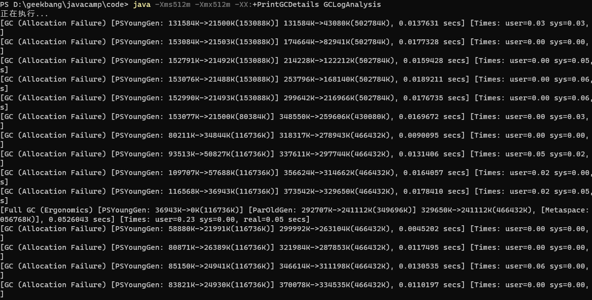
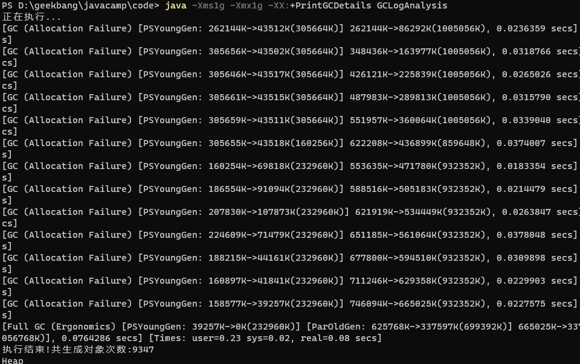
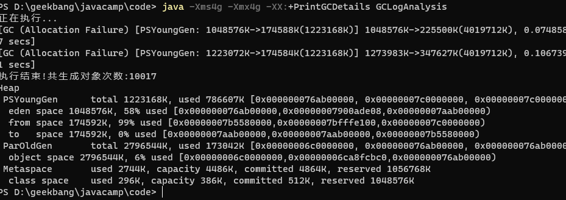
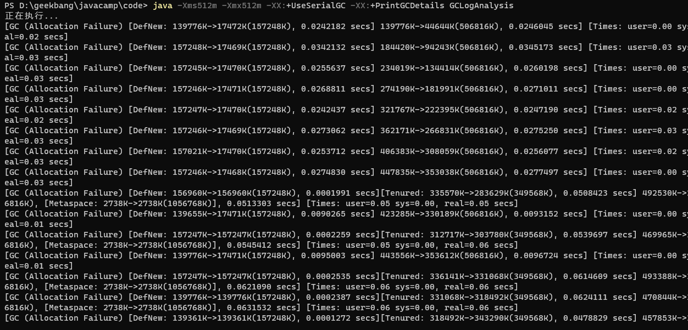
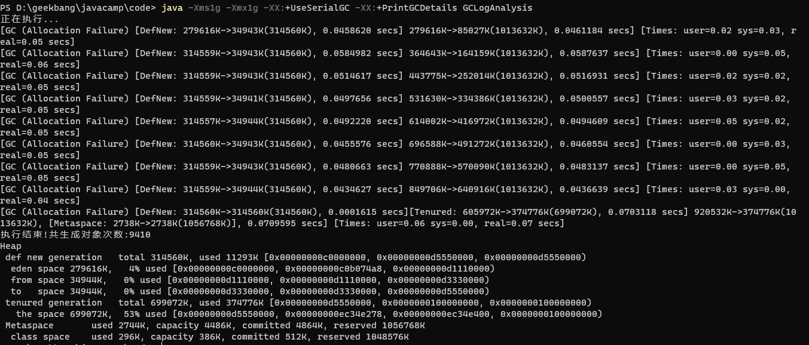
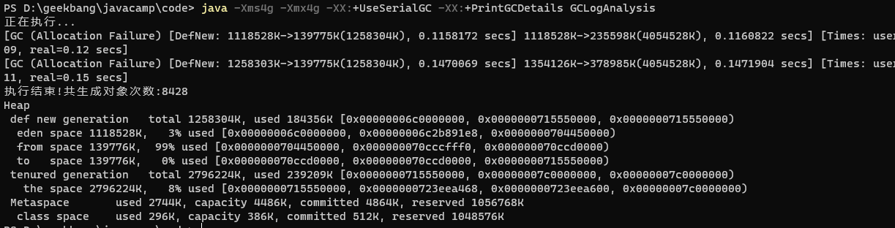
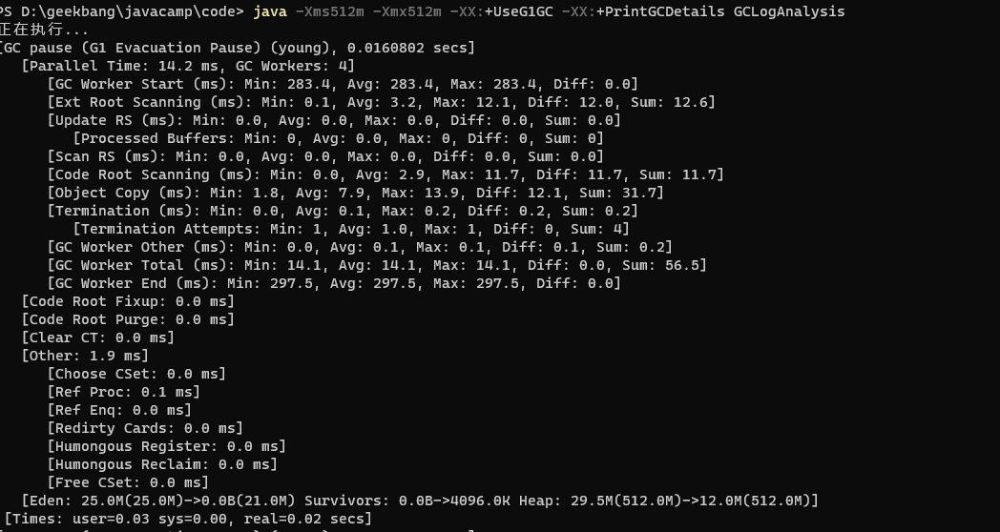
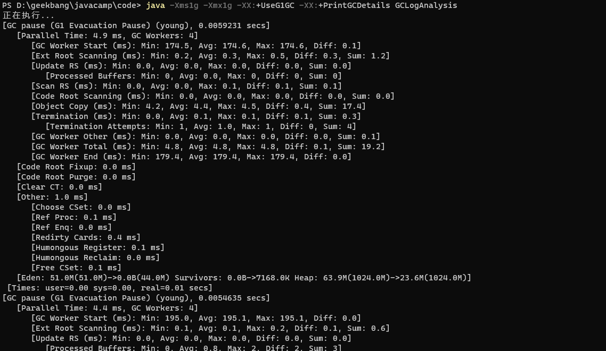
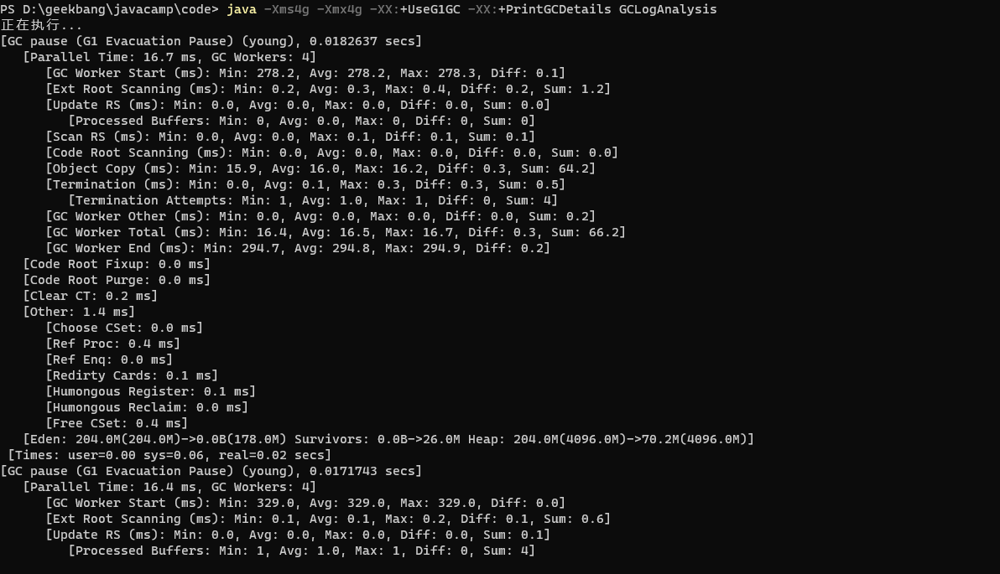

### 并行GC：
xms xmx 512m

xms xmx 1g

xms xmx 4g

### 串行GC:

xms xmx 512m

xms xmx 1g

xms xmx 4g

### CMS GC:
xms xmx 512m

xms xmx 1g

xms xmx 4g

### G1 GC:
xms xmx 512m

xms xmx 1g

xms xmx 4g

