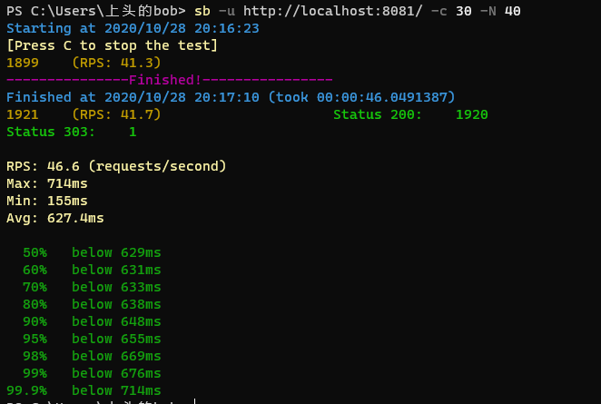
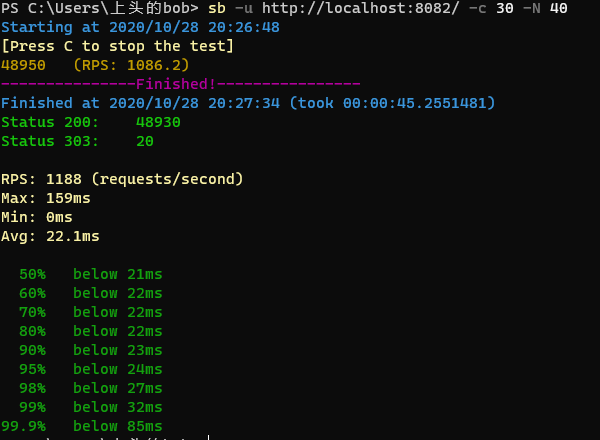
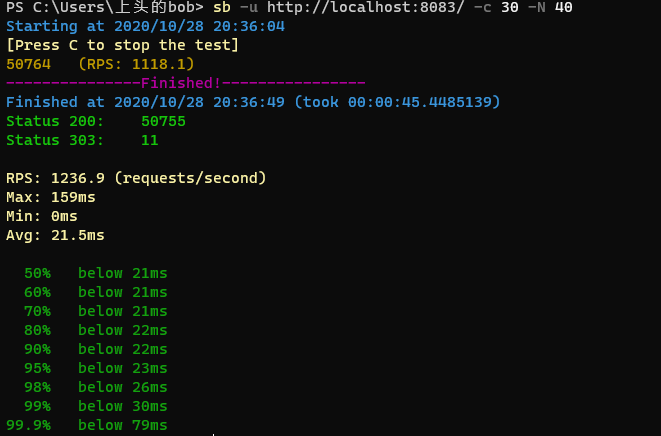
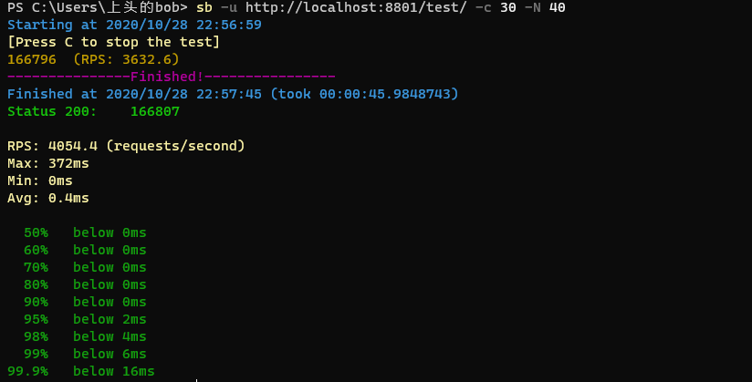

### http01server(bio)

rps较小的原因有：
* 这种方式是阻塞的，因此多线程压测并没有很好的作用
* 程序中有 20ms 暂停时间
* 单线程的方式

### http02

rps 相对于 http01 较高的原因是：
* 使用了多线程机制，为每个请求新建一个线程

存在的问题：
* 线程的创建需要耗费大量资源，而且完成一个请求以后就会自动销毁，浪费资源

### http03

rps 相对于 http02 较高的原因：
* 使用了线程池的机制，减少了在线程创建和销毁过程中的资源浪费

### netty

rps 相对于 http03 较高的原因：
* 使用了协程，基于事件和回调机制，大大提高了资源的利用效率