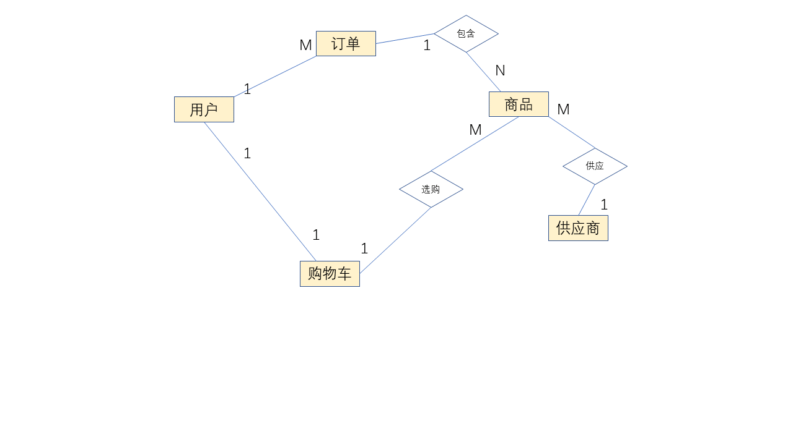
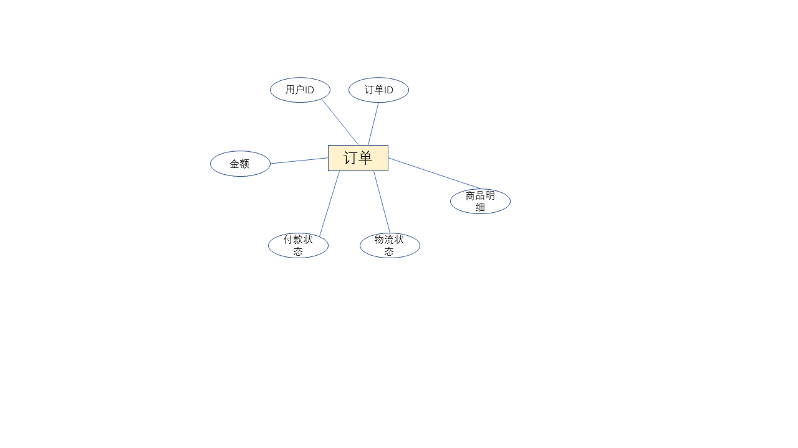
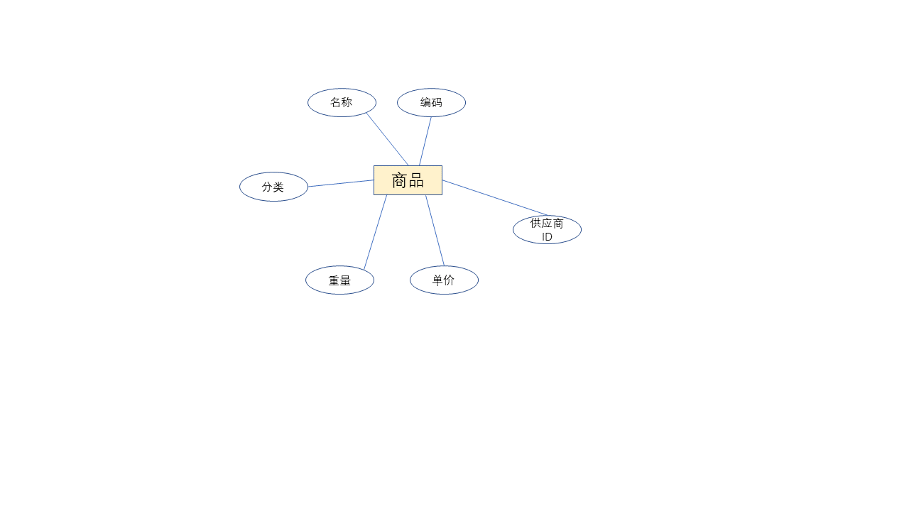

2.（必做）基于电商交易场景（用户、商品、订单），设计一套简单的表结构，提交 DDL 的 SQL 文件到 Github（后面 2 周的作业依然要是用到这个表结构）。

关于交易场景简单的关系图：


详情如下：
用户表：

```SQL
CREATE TABLE `user` (
`id`  bigint(18) NOT NULL AUTO_INCREMENT ,
`name`  varchar(20) CHARACTER SET utf8mb4 COLLATE utf8mb4_0900_ai_ci NOT NULL ,
`nickname`  varchar(20) CHARACTER SET utf8mb4 COLLATE utf8mb4_0900_ai_ci NULL DEFAULT NULL ,
`password`  varchar(32) CHARACTER SET utf8mb4 COLLATE utf8mb4_0900_ai_ci NOT NULL ,
`gender`  varchar(1) CHARACTER SET utf8 COLLATE utf8_general_ci NOT NULL DEFAULT 'M' COMMENT '\'M 男性，W 女性‘' ,
`personID`  varchar(32) CHARACTER SET utf8mb4 COLLATE utf8mb4_0900_ai_ci NOT NULL ,
`create_time`  datetime NOT NULL ,
`update_time`  datetime NOT NULL ,
`del_flag`  int(1) NOT NULL DEFAULT 0 COMMENT '’0 未删除， 1 已删除‘' ,
PRIMARY KEY (`id`)
)
;
```

订单表：

```SQL
CREATE TABLE `order` (
`id`  bigint(18) NOT NULL AUTO_INCREMENT ,
`user_id`  bigint(18) NOT NULL ,
`salary`  decimal(10,2) NOT NULL ,
`pay_state`  varchar(20) CHARACTER SET utf8mb4 COLLATE utf8mb4_0900_ai_ci NOT NULL DEFAULT 'unpaied' COMMENT '\'unpaied 交易未完成， paied 交易完成\'' ,
`delivery_state`  varchar(20) CHARACTER SET utf8 COLLATE utf8_general_ci NOT NULL DEFAULT '' COMMENT '\'对应具体的物流信息‘' ,
`create_time`  datetime NOT NULL ,
`update_time`  datetime NOT NULL ,
`del_flag`  int(1) NOT NULL DEFAULT 0 COMMENT '’0 未删除， 1 已删除‘' ,
PRIMARY KEY (`id`),
CONSTRAINT `user_id` FOREIGN KEY () REFERENCES `user` (`id`) ON DELETE CASCADE ON UPDATE RESTRICT
)
;
```

商品表:

```SQL
CREATE TABLE `commodity` (
`id`  bigint(18) NOT NULL AUTO_INCREMENT ,
`name`  varchar(20) NOT NULL ,
`classification`  varchar(20) NOT NULL ,
`code`  varchar(32) CHARACTER SET utf8mb4 COLLATE utf8mb4_0900_ai_ci NOT NULL DEFAULT '' ,
`weight`  float(10,0) NOT NULL DEFAULT '' ,
`create_time`  datetime NOT NULL ,
`update_time`  datetime NOT NULL ,
`del_flag`  int(1) NOT NULL DEFAULT 0 COMMENT '’0 未删除， 1 已删除‘' ,
`price`  decimal(10,2) NOT NULL ,
`supplier_id`  bigint(18) NOT NULL ,
PRIMARY KEY (`id`),
CONSTRAINT `commodity` FOREIGN KEY (`supplier_id`) REFERENCES `supplier` (`id`)
)
;
```

店铺表：

```SQL
CREATE TABLE `supplier` (
`id`  bigint(18) NOT NULL AUTO_INCREMENT ,
`name`  varchar(20) CHARACTER SET utf8mb4 COLLATE utf8mb4_0900_ai_ci NOT NULL ,
`contact`  varchar(20) CHARACTER SET utf8mb4 COLLATE utf8mb4_0900_ai_ci NOT NULL ,
`register_id`  varchar(32) CHARACTER SET utf8mb4 COLLATE utf8mb4_0900_ai_ci NOT NULL ,
`create_time`  datetime NOT NULL ,
`update_time`  datetime NOT NULL ,
`del_flag`  int(255) NOT NULL DEFAULT 0 COMMENT '’0 未删除， 1 已删除‘' ,
PRIMARY KEY (`id`)
)
;
```

购物车表:

```SQL
CREATE TABLE `cart` (
`id`  bigint(18) NOT NULL AUTO_INCREMENT ,
`user_id`  bigint(18) NOT NULL ,
`salary`  decimal(10,2) NOT NULL DEFAULT 0.00 ,
`discount`  decimal(10,2) NOT NULL DEFAULT 0.00 ,
`create_time`  datetime NOT NULL ,
`update_time`  datetime NOT NULL ,
`del_flag`  int(255) NOT NULL DEFAULT 0 COMMENT '’0 未删除， 1 已删除‘' ,
PRIMARY KEY (`id`),
CONSTRAINT `cart` FOREIGN KEY (`user_id`) REFERENCES `user` (`id`)
)
;
```

